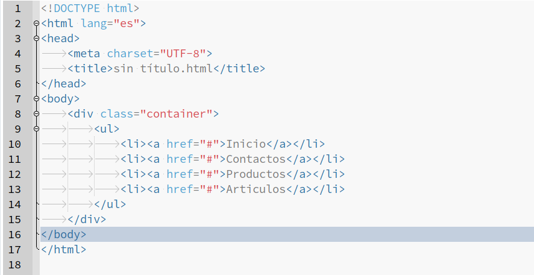
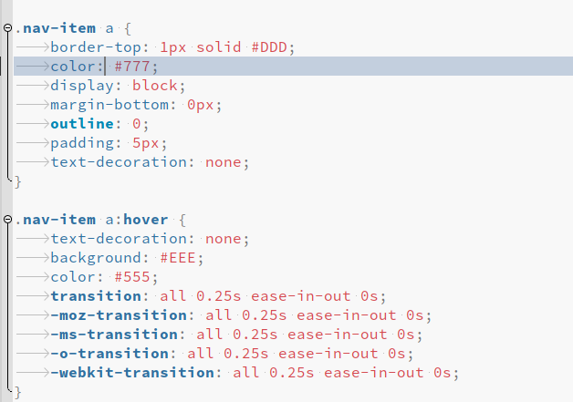
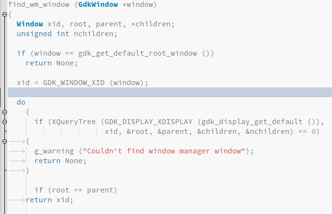

# Geany Winter scheme
Un simple esquema claro para Geany IDE

## Descargar e Instalar

```
git clone https://github.com/diazvictor/geany-winter-scheme.git
cp -a geany-winter-scheme/filetypes.common $HOME/.config/geany/filedefs/
cp -a geany-winter-scheme/winter-scheme.conf $HOME/.config/geany/colorschemes/
```






